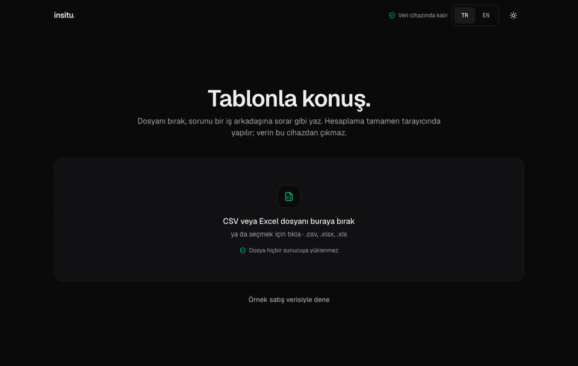
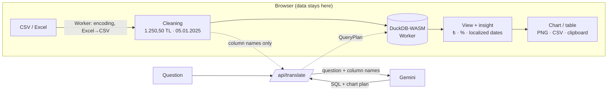

# insitu.

[Türkçe](README.tr.md) · **English**

**Talk to your table.** Drop a CSV or Excel file, ask the way you'd ask a colleague, and get a presentation-ready chart plus a one-sentence insight in seconds. Your data never leaves your device.



> *In situ* — Latin for "in its original place". Every computation runs in the user's own browser.

**Live demo:** [insitu-five.vercel.app](https://insitu-five.vercel.app)

## How it works



1. **Read:** The file is prepared in a Web Worker (Excel → CSV, Windows-1254 → UTF-8) and loaded into DuckDB-WASM. It is never sent to a server.
2. **Clean:** Every column is first read as text; a single profiling query decides its format. Values like `1.250,50 TL`, `₺ 999,99`, `05.01.2025` or `5/1/2025` become proper types. A column is converted only if **every** value fits the format. Money is stored as `DECIMAL` so sums never drift by a cent.
3. **Translate:** Only the question and the column names/types go to the AI (`{ question, columns }`). The schema is strict (`z.strictObject`) — there is no field for row data. Gemini returns a SQL query and a chart plan.
4. **Run:** The SQL passes a guard (single `SELECT`, no file or network functions) and runs in DuckDB in the browser. After loading, DuckDB's external access is disabled and locked.
5. **Draw:** If the result is consistent with the plan it becomes a metric, bar, line or pie chart; otherwise it falls back to a table instead of a misleading chart. The insight sentence is never written by the AI: the model can't see the result, so the sentence is computed from the real result in the browser.

## Accuracy principles

- **No invented numbers.** The model never sees the data; every number comes from DuckDB, every insight from the actual result.
- **Exact totals.** Money columns are `DECIMAL`; client-side sums use Neumaier summation. Verified to the cent on a 100,000-row test.
- **No misleading charts.** Repeated categories, negative pie slices or more than 7 slices (merged into "Other") are checked. No chart or total is derived from a truncated (partial) result.
- **Meaningful insights.** No percentages from a zero base, no growth rates on cumulative series, and an incomplete last period is called out.

## Built not to freeze

| Work | Where it runs |
|---|---|
| File reading, Excel parsing, re-encoding | `prepare.worker.ts` (Web Worker) |
| All SQL, the cleaning profile | DuckDB-WASM (Web Worker) |
| Results on screen | At most 10,000 rows fetched, 500 shown in tables, line charts ≤ 2,000 points |

Loading and querying a 100,000-row, Windows-1254-encoded, `;`-separated Turkish CSV produced **zero** main-thread tasks over 50 ms (Long Tasks API).

## Languages

The **TR | EN** switch in the top-right changes the UI, insight sentences, number and date formats (₺1.234,56 ↔ ₺1,234.56, "25 Eyl 2026" ↔ "Sep 25, 2026") and the titles/labels the AI generates. The choice is stored in a cookie; on the first visit the browser language decides. All text lives in `src/lib/i18n.ts`, and the English dictionary must match the Turkish type — a missing translation is a compile error. Amounts are shown in Turkish lira in both languages.

## Tech

Turkish / English UI · Dark (default) and light theme · Next.js 16 (App Router) · TypeScript (strict) · Tailwind CSS v4 · shadcn/ui · Recharts · DuckDB-WASM · SheetJS · Zod · Gemini API · Vitest

## Run locally

```bash
npm install
echo "GEMINI_API_KEY=your-key" > .env.local   # without it, a rule-based fallback translator is used
npm run dev                                    # http://localhost:3000
```

| Command | What it does |
|---|---|
| `npm test` | Unit tests (formatting, cleaning against real DuckDB, views, insights, guard, schema, i18n) |
| `npm run eval` | Runs the 63 questions in `scripts/questions.txt` end to end with real Gemini + DuckDB |
| `npm run typecheck` · `npm run lint` · `npm run build` | Type check, lint, production build |

## Deploy to Vercel

1. Import the repo at [vercel.com/new](https://vercel.com/new) (no extra configuration needed).
2. Add `GEMINI_API_KEY` under **Settings → Environment Variables**.
3. Deploy. The Hobby plan is free for personal projects.

> **Quota protection:** `/api/translate` is limited to 10 requests per IP per minute (`src/lib/rate-limit.ts`). The limit is kept in memory, so on Vercel each server instance counts separately — set a quota on the key in Google AI Studio for a hard cap.

## Project structure

```
src/
  app/api/translate/route.ts   The only server endpoint (question + column names → plan)
  lib/translator/              Gemini system prompt and schema; keyless fallback
  lib/engine/                  DuckDB, cleaning, worker, SQL guard, normalize
  lib/result-view.ts           Plan + rows → drawable view
  lib/insight.ts, format.ts    Insight sentence; ₺ / % / date formats
  lib/i18n.ts                  All UI text (tr, en)
  components/                  Bento result screen, chart, metric, table
scripts/eval.mts               End-to-end question-set evaluation
```

See [`CLAUDE.md`](CLAUDE.md) for architecture rules and development principles (in Turkish) and [`docs/design-system.md`](docs/design-system.md) for the design system.

### Claude Code skills

The project was built with skills in `.claude/skills/`. `ui-ux-pro-max` and `nextjs-app-router-patterns` (MIT) are included. `mastering-typescript` is published without a license, so it is not included; to install it:

```bash
git clone --depth 1 https://github.com/SpillwaveSolutions/mastering-typescript-skill /tmp/mts
cp -R /tmp/mts/mastering-typescript .claude/skills/
```
