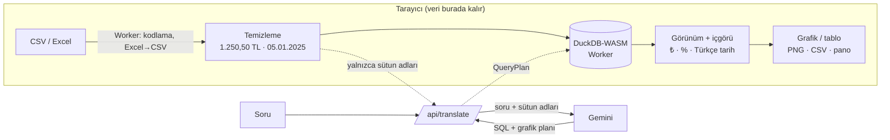

# insitu.

**Türkçe** · [English](README.md)

**Tablonla konuş.** CSV veya Excel dosyanı bırak, sorunu bir iş arkadaşına sorar gibi yaz; saniyeler içinde sunuma hazır bir grafik ve tek cümlelik bir içgörü al. Verin bu cihazdan hiç çıkmaz.


> *In situ* — Latince "kendi yerinde". Tüm hesaplama kullanıcının kendi tarayıcısında yapılır.

**Canlı demo:** DEMO_URL

## Nasıl çalışır



1. **Oku:** Dosya bir Web Worker'da hazırlanır (Excel → CSV, Windows-1254 → UTF-8) ve DuckDB-WASM'e yüklenir. Hiçbir sunucuya gönderilmez.
2. **Temizle:** Her sütun önce metin olarak okunur; tek bir profil sorgusu biçimi belirler. `1.250,50 TL`, `₺ 999,99`, `05.01.2025`, `5/1/2025` gibi değerler standart tiplere çevrilir. Bir sütun ancak **tüm** değerleri aynı biçime uyuyorsa dönüştürülür. Para değerleri kuruş hatası olmaması için `DECIMAL` olarak saklanır.
3. **Çevir:** Yapay zekâya yalnızca soru ile sütun adları ve tipleri gider (`{ question, columns }`). Şema katı (`z.strictObject`), satır verisi için alan yoktur. Gemini bir SQL sorgusu ve grafik planı döndürür.
4. **Çalıştır:** SQL bir korumadan geçer (tek `SELECT`, dosya ve ağ fonksiyonları yok) ve tarayıcıdaki DuckDB'de çalışır. Yükleme sonrası DuckDB'nin dış erişimi kapatılıp kilitlenir.
5. **Çiz:** Sonuç veriyle tutarlıysa metrik, çubuk, çizgi veya pasta grafik olarak çizilir; tutarsızsa yanlış bir grafik yerine tabloya düşer. İçgörü cümlesi yapay zekâya yazdırılmaz: model sonucu görmediği için gerçek sonuçtan tarayıcıda hesaplanır.

## Doğruluk ilkeleri

- **Uydurma sayı yok.** Model veriyi görmez; her sayı DuckDB'den, her içgörü gerçek sonuçtan gelir.
- **Kesin toplamlar.** Para sütunları `DECIMAL`, istemci toplamları Neumaier toplamıyla yapılır. 100.000 satırlık bir testte toplam kuruşuna kadar doğrulandı.
- **Yanıltıcı grafik yok.** Tekrarlı kategoriler, negatif pasta dilimleri ya da 7'den fazla dilim ("Diğer"de birleşir) gibi durumlar denetlenir. Kesilmiş (kısmi) sonuçlardan grafik veya toplam üretilmez.
- **Anlamlı içgörü.** Sıfır tabandan yüzde hesaplanmaz; kümülatif serilerde büyüme oranı verilmez; tamamlanmamış son dönem ayrıca belirtilir.

## Donmaya karşı

| İş | Nerede çalışır |
|---|---|
| Dosya okuma, Excel ayrıştırma, kodlama dönüşümü | `prepare.worker.ts` (Web Worker) |
| Tüm SQL, temizleme profili | DuckDB-WASM (Web Worker) |
| Ekrana gelen sonuç | En fazla 10.000 satır getirilir, tabloda 500 satır gösterilir, çizgi grafik ≤ 2.000 nokta |

100.000 satırlık, Windows-1254 kodlu, `;` ayraçlı bir Türkçe CSV ile yükleme ve sorgular sırasında ana thread'de **hiç** 50 ms'yi aşan görev ölçülmedi (Long Tasks API).

## Dil desteği

Sağ üstteki **TR | EN** düğmesiyle arayüz, içgörü cümleleri, sayı ve tarih biçimleri (₺1.234,56 ↔ ₺1,234.56, "25 Eyl 2026" ↔ "Sep 25, 2026") ve yapay zekânın ürettiği başlık ve etiketler değişir. Tercih bir çerezde tutulur; ilk ziyarette tarayıcı dili esas alınır. Tüm metinler `src/lib/i18n.ts` içindedir ve İngilizce sözlük Türkçe ile aynı tipe uymak zorundadır; eksik çeviri derleme hatası verir.

## Teknoloji

Türkçe / İngilizce arayüz (sağ üstten) · Karanlık (varsayılan) ve aydınlık tema · Next.js 16 (App Router) · TypeScript (katı mod) · Tailwind CSS v4 · shadcn/ui · Recharts · DuckDB-WASM · SheetJS · Zod · Gemini API · Vitest

## Yerelde çalıştırma

```bash
npm install
echo "GEMINI_API_KEY=anahtarın" > .env.local   # yoksa kural tabanlı yedek çevirmen devreye girer
npm run dev                                     # http://localhost:3000
```

| Komut | Ne yapar |
|---|---|
| `npm test` | Birim testleri (biçimlendirme, temizleme — gerçek DuckDB ile, görünüm, içgörü, guard, şema) |
| `npm run eval` | `scripts/questions.txt` içindeki 63 soruyu gerçek Gemini + DuckDB ile uçtan uca çalıştırır |
| `npm run typecheck` · `npm run lint` · `npm run build` | Tip denetimi, lint, üretim derlemesi |

## Vercel'e yayınlama

1. Repoyu [vercel.com/new](https://vercel.com/new) üzerinden içe aktar (ek ayar gerekmez).
2. **Settings → Environment Variables** altında `GEMINI_API_KEY` ekle.
3. Yayınla. Hobby planı kişisel projeler için ücretsizdir.

> **Kota koruması:** `/api/translate` IP başına dakikada 10 istekle sınırlıdır (`src/lib/rate-limit.ts`). Sınır bellekte tutulur; Vercel'de her sunucu örneği ayrı sayar. Bu nedenle kesin bir üst sınır için Google AI Studio'da anahtara ayrıca kota koy.

## Proje yapısı

```
src/
  app/api/translate/route.ts   Tek sunucu uç noktası (soru + sütun adları → plan)
  lib/translator/              Gemini sistem prompt'u ve şeması; anahtarsız yedek
  lib/engine/                  DuckDB, temizleme, worker, SQL guard, normalize
  lib/result-view.ts           Plan + satırlar → çizilebilir görünüm
  lib/insight.ts, format.ts    İçgörü cümlesi; ₺ / % / tarih biçimleri
  lib/i18n.ts                  Tüm arayüz metinleri (tr, en)
  components/                  Bento sonuç ekranı, grafik, metrik, tablo
scripts/eval.mts               Uçtan uca soru seti değerlendirmesi
```

Mimari kurallar ve geliştirme ilkeleri için [`CLAUDE.md`](CLAUDE.md), tasarım sistemi için [`docs/design-system.md`](docs/design-system.md).

### Claude Code skill'leri

Proje `.claude/skills/` altındaki skill'lerle geliştirildi. `ui-ux-pro-max` ve `nextjs-app-router-patterns` (MIT) depoda bulunur. `mastering-typescript` lisanssız yayımlandığı için depoya eklenmedi; kurmak için:

```bash
git clone --depth 1 https://github.com/SpillwaveSolutions/mastering-typescript-skill /tmp/mts
cp -R /tmp/mts/mastering-typescript .claude/skills/
```
